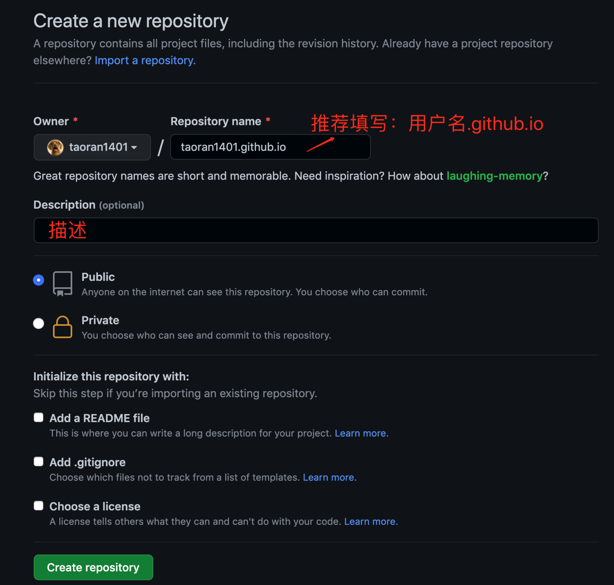
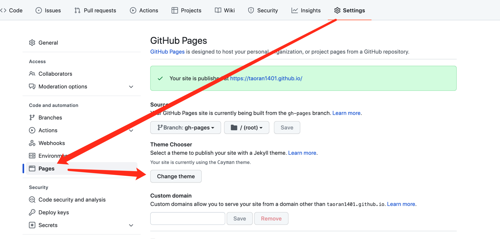
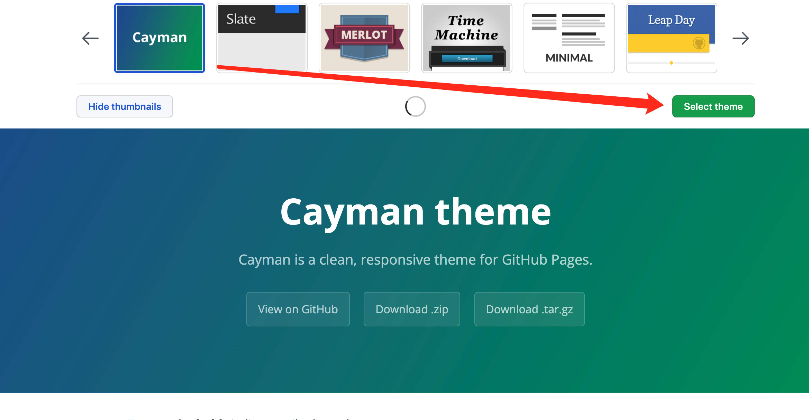
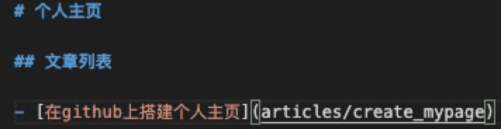
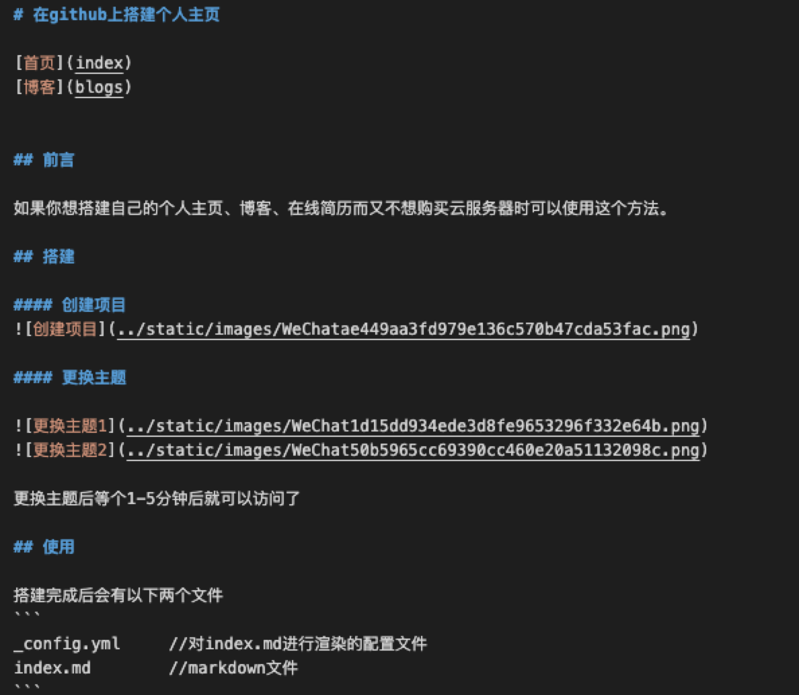
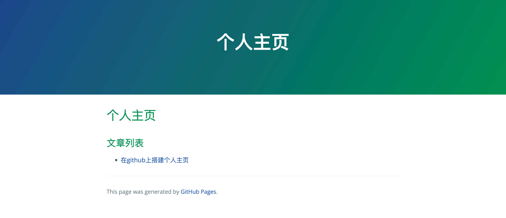
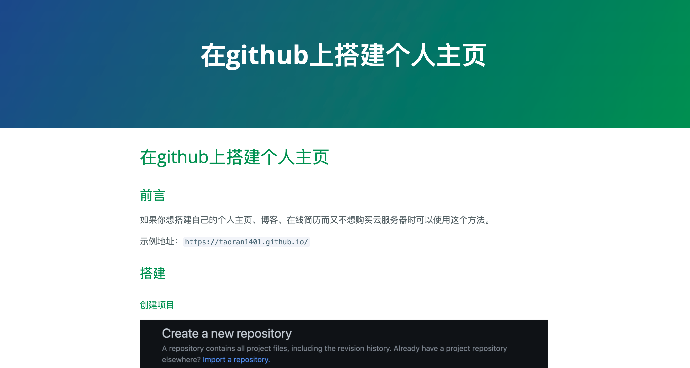

# 在github上搭建个人主页

## 前言

如果你想快速搭建自己的个人主页、博客、在线简历而又不想购买云服务器时可以使用这个方法。

示例地址：`https://taoran1401.github.io/`

## 搭建

#### 创建项目


#### 更换主题




更换主题后等个1-5分钟后就可以访问了

## 使用

搭建完成后会有以下两个文件
```
_config.yml     //对index.md进行渲染的配置文件
index.md        //markdown文件
```

#### 编写内容

首页：在`index.md`中添加


文章页面： 在`articles/create_mypage.md`中添加



如果觉得不够美观可以使用html编写，或者使用jekyll来处理

jekyll地址： `http://jekyllcn.com/`

## 自定义域名

这里不详细讲了，用aliyun购买的域名举例

1.首先使用ping命令获取ip地址，一会儿用于域名解析

```
ping 用户名.github.io   
# 结果示例：64 bytes from xxx.xxx.110.153: icmp_seq=0 ttl=54 time=100.292 ms
# `xxx.xxx.110.153`这段就是ip
```

2.进入阿里云控制台域名解析地址到刚才获取的的ip地址即可; 

## 最终效果

首页


文章
